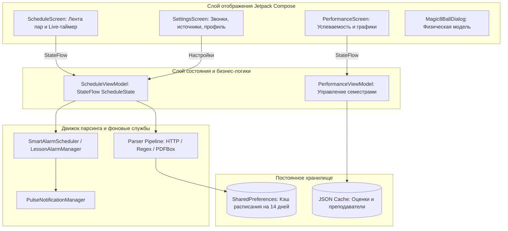
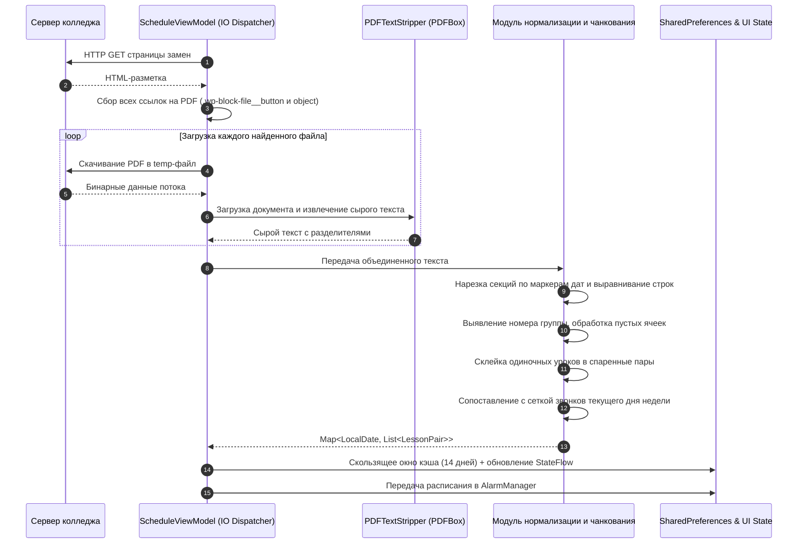

# Pulse-Releases
# Pulse

Pulse — Android-клиент для автоматизированного мониторинга расписания занятий, учета успеваемости и синхронизации учебного процесса. Приложение устраняет необходимость вручную отслеживать таблицы замен на веб-портале учебного заведения, самостоятельно выгружает документы, очищает поврежденную разметку и агрегирует пары по расписанию звонков.

---

## Архитектура системы

В основе приложения лежит компонентный подход Android Architecture Components с реактивным потоком данных Unidirectional Data Flow (UDF).



---

## Схема работы парсера расписания

Парсер обрабатывает нестабильную верстку таблиц в PDF и собирает единый график при наличии нескольких документов замен на сайте.



---

## Назначение модулей и исходных файлов

### 1. Модуль расписания

* **`ScheduleViewModel.kt`**: главный координатор данных.


* `fetchAllPdfUrls`: сканирует сайт, выявляет все опубликованные кнопки замены и теги для встроенного просмотра.


* `downloadAndExtractPdf`: производит потоковую загрузку файлов с лимитом размера и выгрузкой текста через `PDFTextStripper`.


* `extractTableChunks` и `tryParseBrokenLine`: восстанавливают геометрию строк при повреждении вертикальных разделителей таблицы.


* `parseRawText`: фильтрует строки по целевой группе, устраняет склейку уроков и присваивает тайминги звонков.


* **`ScheduleScreen.kt`**: пользовательский интерфейс расписания.


* `LiveScheduleEngine`: таймер с динамической волной на `Canvas`, отслеживающий статус занятия в реальном времени.


* `ScheduleTimelineList`: интерактивная лента пар с привязкой задач.


* `ScheduleConstructorDialog`: рендер расписания в изображение для отправки в мессенджеры.


### 2. Модуль успеваемости

* **`PerformanceScreen.kt`**: аналитический модуль.


* `mergeSimilarGrades`: алгоритм дедупликации, сопоставляющий различные варианты написания одного и того же предмета в единую сущность.


* `AverageScoreCard`: расчет среднего балла с переключением режима округления (целые, десятые, сотые).


* `getNeededGradesText`: математический расчет требуемого количества положительных оценок для достижения целевого балла.


* `LineChartCard` и `DynamicDonutChart`: графическая визуализация динамики успеваемости на `Canvas`.


### 3. Модуль настроек и уведомлений

* **`SettingsScreen.kt`**: центр управления приложением.


* Редактор звонков для пяти типов дней (обычные, понедельник, четверг, суббота, сокращенные).


* Список распознанных PDF-источников с отображением статуса каждого файла.


* Очистка кэшированных данных с анимацией заполнения волной.


* **`NotificationsScreen.kt`**: локальные оповещения.


* `SwipeLiquidBackground`: физическая модель свайпа карточки с вытягиванием контура через кубические кривые Безье.


* Фильтрация системных и пользовательских уведомлений.


* **`Magic8BallDialog.kt`**: интерактивная пасхалка.


* Обработка физических сил через `SensorManager` (акселерометр).
* Имитация всплытия кубика в вязкой чернильной среде с многослойной отрисовкой бликов и преломлений линзы.
* Виброотклик через `Vibrator` при соударении объекта со смотровым окном.


---

## Стек технологий

| Категория | Технологии |
| --- | --- |
| Язык разработки | Kotlin 2.0+

 |
| Пользовательский интерфейс | Jetpack Compose, Material 3, Compose Navigation

 |
| Асинхронность | Kotlin Coroutines, StateFlow, SharedFlow

 |
| Обработка документов | PdfBox-Android

 |
| Графика и анимация | Compose Canvas, DrawScope, Path, InfiniteTransition

 |
| Системные сервисы | SensorManager (акселерометр), AlarmManager, VibratorManager

 |
| Хранилище данных | Android SharedPreferences, JSON Serialization

 |

---

## Сборка и запуск

1. Склонировать репозиторий:
```bash
git clone https://github.com/ticker-01/Pulse-Releases.git

```


2. Открыть проект в Android Studio Ladybug (2024.2.1) или более новой версии.
3. Дождаться окончания синхронизации Gradle-зависимостей.
4. Выполнить сборку проекта:
```bash
./gradlew assembleDebug

```
