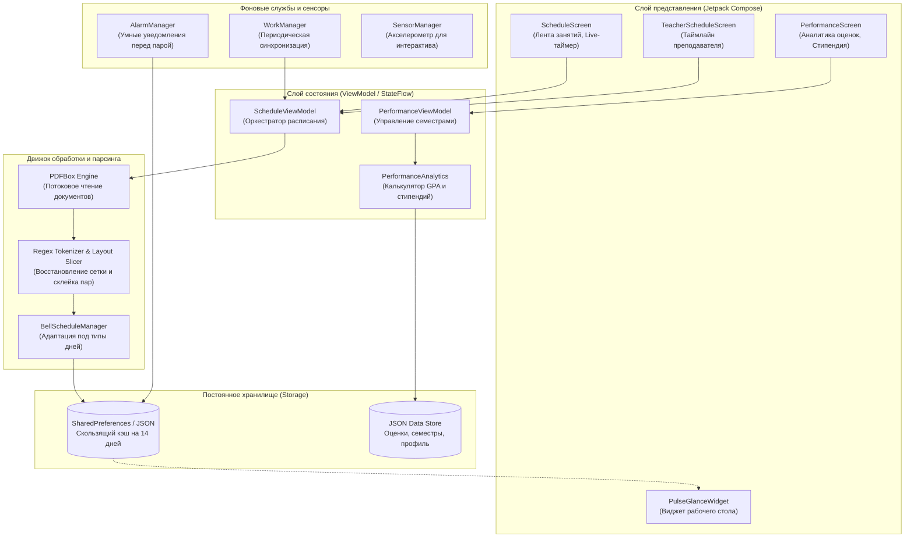
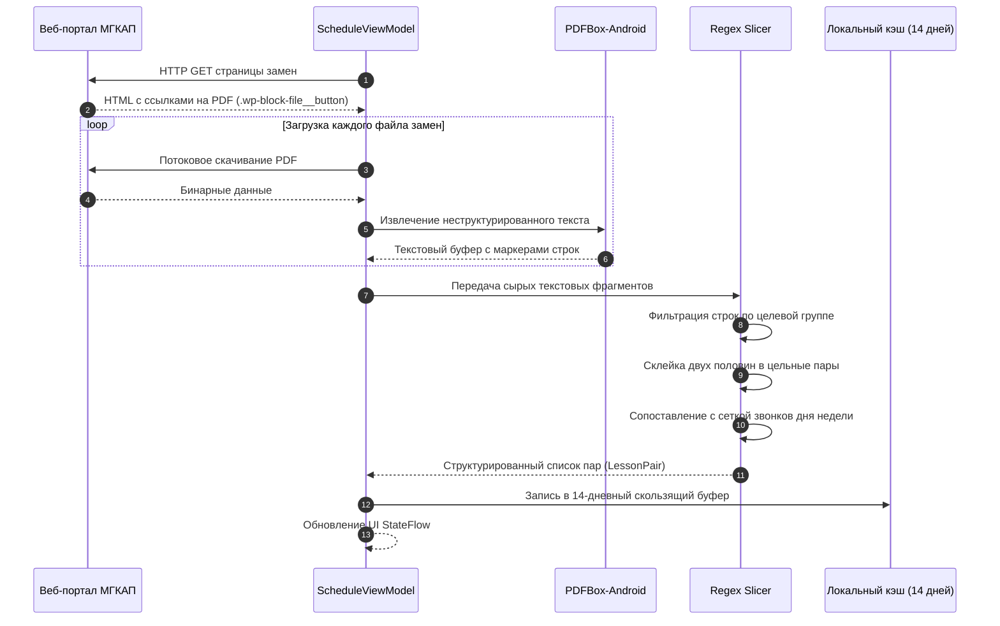
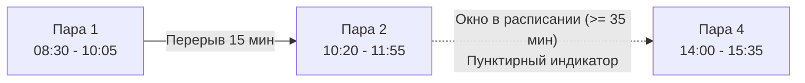
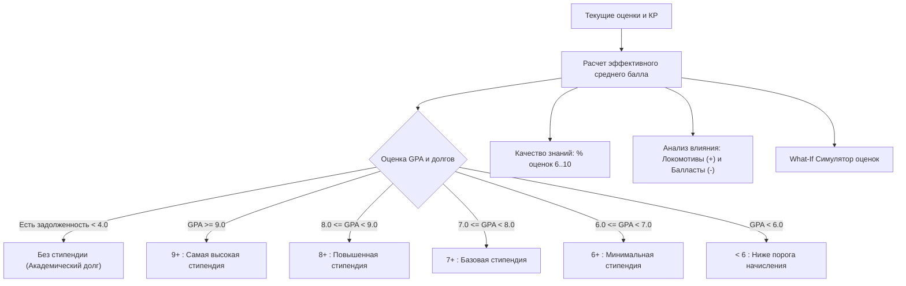
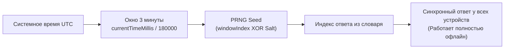

# <p align="center">Pulse</p>

<p align="center">
  <b>Клиент автоматизированного мониторинга расписания и учета успеваемости для МГКАП</b>
</p>

<p align="center">
  <i>(Ранее разрабатывался под названием «МГКАП Расписание»)</i>
</p>

<p align="center">
  <a href="https://github.com/ticker-01/Pulse-Releases/releases"></a>
  
  
  
  
  
</p>

<p align="center">
  <a href="https://github.com/ticker-01/Pulse-Releases/raw/main/Pulse.apk"><b>Скачать файл установки (Pulse.apk)</b></a> |
  <a href="#функциональные-возможности">Функциональность</a> |
  <a href="#архитектура-приложения">Архитектура</a> |
  <a href="#модуль-успеваемости-и-стипендии">Стипендия и аналитика</a> |
  <a href="#сборка-и-установка">Установка</a>
</p>

---

## Общие сведения

**Pulse** — специализированное Android-приложение для учащихся и преподавательского состава Минского государственного колледжа автомобильного транспорта и машиностроения (МГКАП).

Сервис автоматизирует сбор и визуализацию ежедневного учебного расписания, отслеживает замены с официального веб-ресурса колледжа, парсит PDF-документы с поврежденной структурой разметки и предоставляет комплексный аналитический инструментарий для контроля успеваемости.

---

## Архитектура приложения

В основе Pulse лежит шаблон Unidirectional Data Flow (UDF) с реактивным управлением состоянием через `StateFlow` и `SharedFlow` в среде Jetpack Compose.



---

## Схема обработки расписания и замен

На официальном сайте колледжа замены публикуются в формате PDF-документов с нерегулярной версткой. Парсер Pulse считывает HTML-страницу замен, выгружает документы в оперативную память и нормализует табличные данные:



---

## Функциональные возможности

### 1. Расписание занятий и замены
* **Автоматическое обновление:** Фоновое скачивание и разбор новых документов замен без участия сторонних серверов.
* **Адаптивная сетка звонков:** Автоматическое переключение расписания звонков в зависимости от дня (понедельник, четверг, суббота, сокращенный график).
* **Офлайн-доступ:** Кэширование расписания на 14 дней вперед обеспечивает просмотр при отсутствии сети.
* **Режим сверки:** Быстрое переключение на расписание других групп и кабинетов колледжа.
* **Экспорт расписания:** Генерация графической карточки дня для отправки в Telegram или VK.

### 2. Расписание преподавателей
Интерфейс таймлайна для просмотра учебного плана преподавателей с точной геометрической привязкой:



* Определение аудиторий, групп и типа занятия (лекция, практика, лабораторная).
* Пунктирная отрисовка межурочных окон при перерывах от 35 минут.

---

## Модуль успеваемости и стипендии

Система автоматического мониторинга учебных результатов рассчитывает средний балл (GPA), качество знаний и категорию стипендии по ступеням 9+, 8+, 7+, 6+:



### Градации стипендий
| Категория | Диапазон GPA (10-балльная) | Диапазон GPA (5-балльная) | Описание статуса |
| :--- | :--- | :--- | :--- |
| **9+** | 9.00 — 10.00 | 4.80 — 5.00 | Самая высокая (максимальный коэффициент) |
| **8+** | 8.00 — 8.99 | 4.50 — 4.79 | Повышенная стипендия |
| **7+** | 7.00 — 7.99 | 4.00 — 4.49 | Базовая академическая стипендия |
| **6+** | 6.00 — 6.99 | 3.50 — 3.99 | Минимальная стипендия |
| **< 6** | Менее 6.00 | Менее 3.50 | Стипендия не начисляется |
| **Долг** | Оценка < 4.0 | Оценка < 3.0 | При наличии долга стипендия блокируется |

### Дополнительные аналитические метрики:
* **Качество знаний (КЗ):** Доля оценок от 6 до 10 в общем объеме выставленных отметок.
* **Абсолютная успеваемость:** Процент предметов, по которым студент аттестован.
* **Драйверы и якоря GPA:** Автоматический расчет предметов, вносящих наибольший положительный или отрицательный вклад в общий средний балл.
* **Симулятор оценок («Что если?»):** Интерактивная примерка теоретических оценок (обычных и за контрольные работы) с расчетом прогноза GPA в реальном времени.

---

## Виджет рабочего стола и NFC

### Виджет Jetpack Glance
* Отображение текущего и следующего занятия на главном экране устройства.
* Обратный отсчет оставшегося времени пары или перемены.
* Обновление в фоне средствами `WorkManager` без расхода батареи.

### Модуль NFC
* Передача домашних заданий и текстовых заметок между устройствами в одно касание.
* Поддержка записи идентификатора группы на бесконтактные пластиковые карты.

---

## Синхронизированный Magic 8-Ball

Интерактивный модуль принятия решений работает на базе детерминированного псевдослучайного генератора с временными эпохами:



* **Полная автономность:** Единый синхронный результат на смартфонах группы без сетевого взаимодействия.
* **Физическая модель:** Реалистичное колыхание чернильной среды и пузырьков на `Canvas` под управлением акселерометра (`SensorManager`).

---

## Технологический стек

| Направление | Библиотеки и компоненты |
| :--- | :--- |
| **Язык** | Kotlin 2.0+ (Coroutines, Flow, Serialization) |
| **Интерфейс** | Jetpack Compose, Material 3 (Material You Expressive), Navigation Compose |
| **Виджеты** | AndroidX Glance (GlanceAppWidget, GlanceModifier) |
| **Парсинг документов** | PdfBox-Android, Regex Parser Pipeline |
| **Аппаратные датчики** | SensorManager (акселерометр), VibratorManager, NFC Adapter |
| **Фоновые задачи** | AndroidX WorkManager, AlarmManager |
| **Локальные данные** | SharedPreferences, JSON Storage Engine |

---

## Сборка и установка

### Установка готового APK
1. Загрузите актуальный установочный пакет: [**Pulse.apk**](https://github.com/ticker-01/Pulse-Releases/raw/main/Pulse.apk).
2. Подтвердите установку из используемого файлового менеджера или браузера.
3. Запустите приложение и укажите вашу учебную группу МГКАП.

<details>
<summary><b>Инструкция по ручной сборке проекта</b></summary>

```bash
# Клонирование репозитория
git clone https://github.com/ticker-01/Pulse-Releases.git

# Переход в каталог проекта
cd Pulse-Releases

# Сборка установочного пакета Debug
./gradlew assembleDebug
```

Собранный файл будет находиться по пути:
`app/build/outputs/apk/debug/app-debug.apk`
</details>

---

## Обратная связь

По вопросам работы приложения и предложениям по улучшению функциональности создавайте обращения в [Pulse-Releases Issues](https://github.com/ticker-01/Pulse-Releases/issues).

---

<p align="center">
  Проект разработан для студентов и преподавателей <b>МГКАП</b>
</p>
